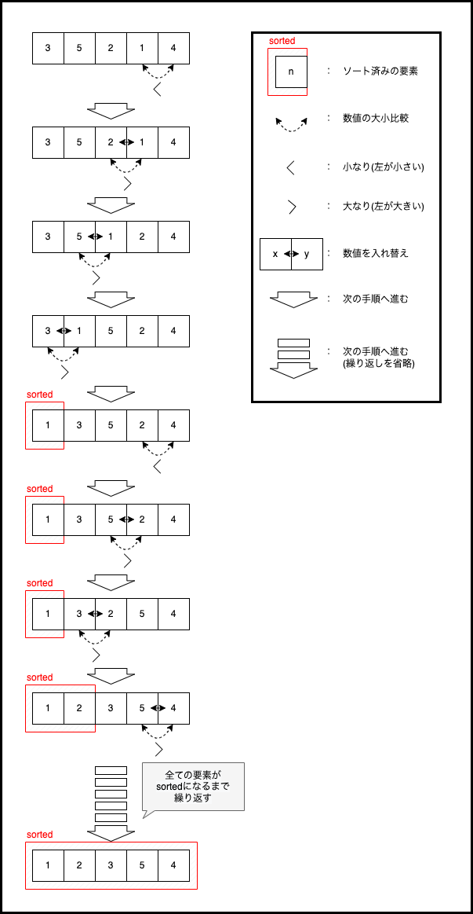
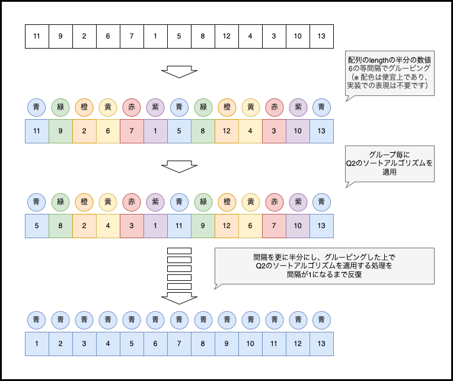

# 20230610-event-questions

## 概要

以下は、6/10(土)開催の「エンジニア学生のためのIT業界研究セミナー」に  
参加するために用意されたコーディング問題です。  
問題は3問ありますが、1,2問目は解答必須、3問目はチャレンジ問題とします。  
高得点を狙う方は、是非3問目にもチャレンジしてください。

## 問題タイトル

- 解答必須問題

    - Q1. ソートアルゴリズム1の実装  
    - Q2. ソートアルゴリズム2の実装  

- チャレンジ問題
    - Q3. ソートアルゴリズム3の実装

各問題の詳細は後述します。

## 対応言語

対応言語は下記の5つです。
- Python3
- Java
- JavaScript
- C#
- Go

言語による採点結果への優劣はありませんので、得意な言語で挑戦してください。

## 採点基準

採点するにあたり、下記のルールは遵守しててください。ルールが守られていない場合は最低ランク評価となります。

1. 実行してエラーとならないこと
2. 正しい結果が得られること
3. 出題したアルゴリズムを利用して結果が得られていること
4. 解答導出に必要のない処理が書かれていないこと
5. 解答用テンプレートに記載のコメント「この中に解答を記述してください」と書かれたファイルにのみ記述をしてください

上記のルールを守った上で、下記の項目を満たす書き方の場合、高得点を獲得することができます。

6. メソッドや空行等で、コード量や処理の意味が適切に区切られていること
7. 読み手の理解しやすい順序で処理が書かれていること
8. 命名が適切であること
9. 記述が冗長でないこと
10. 読み手の理解を助けるコメントが書かれていること

## 評価ランク

上記の評価基準で採点してランク付けされます。

- Sランク：エース級プログラマー
  - 出題されたアルゴリズムを、リーダブルに実装できています
  - 今回のコーディングを意識しながら、色々な実装にチャレンジしてみてください
- Aランク：即戦力プログラマー
  - 出題されたアルゴリズムを、リーダブルに実装できています
  - S評価との差は、あとほんの少しの読み手への配慮だけです
- Bランク：期待の新人プログラマー
  - 出題されたアルゴリズムを実装できています
  - 複雑なアルゴリズムでも読みやすくコーディングできるようにチャレンジしてみてください
- Cランク：基礎習熟プログラマー
  - 出題されたアルゴリズムをある程度実装できています
  - 読み手に配慮したコーディングを意識してみましょう
- Dランク：駆け出しプログラマー
  - 要件に合うアルゴリズムが実装できていない、またはコードの可読性が低いです
  - まずは簡単なアルゴリズムから、読み手の理解しやすさを意識して書いてみましょう

## 解答方法

各問題毎に用意されたテンプレートをコピーして、コーディングをしてください。  
解答は専用の[Googleフォーム](https://forms.gle/P3kDaBFQv3dN1EX49)に必要事項を記入の上、  
解答用テンプレートに記載のコメント「このファイルのみ提出してください」と書かれた  
プログラムファイルのみを添付して送信してください。  
その際、ファイル名の末尾に「.txt」を追加してください。  
例：「logic.py」->「logic.py.txt」  
ファイル名を変更しないと、アップロードできませんのでご注意ください。  

## 問題
### 解答必須

Q1：ソートアルゴリズム1の実装（[解答用テンプレート](/template/Q1_Sort)）  
以下のイメージに合致するソートアルゴリズムを実装してください。  
ソート対象の配列は「1つ以上の要素を持つ、ランダムに並べられた重複のない整数の配列」です。

ソートアルゴリズム1    

Q2：ソートアルゴリズム2の実装（[解答用テンプレート](/template/Q2_Sort)）  
以下のイメージに合致するソートアルゴリズムを実装してください。  
ソート対象の配列は「1つ以上の要素を持つ、ランダムに並べられた重複のない整数の配列」です。

ソートアルゴリズム2  

### チャレンジ問題
Q3：ソートアルゴリズム3の実装（[解答用テンプレート](/template/Q3_Sort)）  
以下のイメージに合致するソートアルゴリズムを実装してください。  
ソート対象の配列は「1つ以上の要素を持つ、ランダムに並べられた重複のない整数の配列」です。

ソートアルゴリズム3  

問題は以上です。  

※本リポジトリへの直接のプルリクエスト作成を防ぐため、リポジトリはアーカイブ状態としております。
